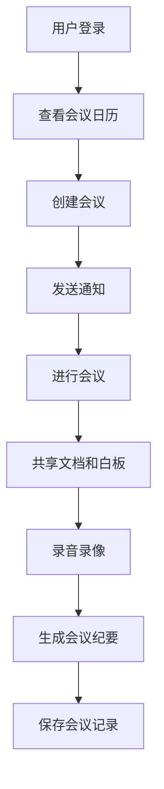
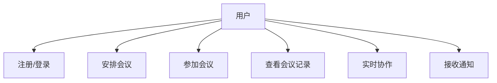

### 智能会议管理系统

---

#### 目录

1. [需求分析](#需求分析)
2. [系统设计](#系统设计)
   - [系统架构](#系统架构)
   - [数据库设计](#数据库设计)
   - [流程图](#流程图)
   - [用例图](#用例图)
3. [开发环境配置](#开发环境配置)

---

### 需求分析

#### 功能需求

1. **用户管理**：
   - 用户注册、登录、注销
   - 用户权限管理

2. **会议管理**：
   - 创建、编辑、删除会议
   - 安排会议时间、地点、参与者
   - 集成日历功能显示会议安排

3. **通知提醒**：
   - 自动发送会议通知和提醒
   - 提前设置提醒时间

4. **实时音视频会议**：
   - 多用户实时音视频会议
   - 屏幕共享、聊天功能

5. **多用户协作**：
   - 共享文档、白板
   - 实时协作编辑

6. **会议记录**：
   - 会议录音和录像
   - 自动生成会议纪要并保存

#### 非功能需求

1. **性能**：
   - 系统响应时间小于1秒
   - 支持至少50个用户同时在线

2. **安全**：
   - 用户数据加密存储
   - 会议内容加密传输

3. **可维护性**：
   - 代码模块化，易于维护和扩展
   - 提供详细的开发文档和使用说明

---

### 系统设计

#### 系统架构

系统采用分层架构，主要包括以下几个层次：

1. **表示层**：负责用户界面和用户交互。
2. **业务逻辑层**：处理业务逻辑和规则。
3. **数据访问层**：与数据库进行交互。
4. **网络通信层**：处理与服务器的通信。

#### 数据库设计

使用MySQL数据库，设计以下主要表结构：

- **用户表 (users)**：
  - user_id (INT, PRIMARY KEY)
  - username (VARCHAR)
  - password (VARCHAR)
  - email (VARCHAR)
  - role (VARCHAR)

- **会议表 (meetings)**：
  - meeting_id (INT, PRIMARY KEY)
  - title (VARCHAR)
  - description (TEXT)
  - start_time (DATETIME)
  - end_time (DATETIME)
  - location (VARCHAR)
  - organizer_id (INT, FOREIGN KEY)

- **会议参与者表 (meeting_participants)**：
  - meeting_id (INT, FOREIGN KEY)
  - user_id (INT, FOREIGN KEY)
  - status (VARCHAR)

- **会议记录表 (meeting_records)**：
  - record_id (INT, PRIMARY KEY)
  - meeting_id (INT, FOREIGN KEY)
  - record_type (VARCHAR)
  - file_path (VARCHAR)
  - created_at (DATETIME)

#### 流程图



#### 用例图



---

### 开发环境配置

#### 环境搭建步骤

1. **安装Qt Creator**：
   - 下载并安装Qt Creator IDE。
   - 配置Qt开发环境。

2. **安装MySQL**：
   - 下载并安装MySQL数据库。
   - 配置MySQL数据库，创建所需数据库和表。

3. **安装FFmpeg**：
   - 下载并安装FFmpeg库。
   - 配置FFmpeg环境变量。

4. **安装Git**：
   - 下载并安装Git版本控制工具。
   - 配置Git用户信息。

#### 配置文件示例

##### CMakeLists.txt

```plaintext
cmake_minimum_required(VERSION 3.10)

# 设置项目名
project(SmartMeetingManager)

# 指定C++标准
set(CMAKE_CXX_STANDARD 11)
set(CMAKE_CXX_STANDARD_REQUIRED True)

# 查找Qt包
find_package(Qt5 COMPONENTS Core Gui Widgets Network Sql Multimedia REQUIRED)

# 包含头文件目录
include_directories(${CMAKE_SOURCE_DIR}/include)

# 源文件列表
set(SOURCES
    src/main.cpp
    src/mainwindow.cpp
    src/login.cpp
    src/meeting.cpp
    src/notification.cpp
    src/collaboration.cpp
    src/recording.cpp
)

# 头文件列表
set(HEADERS
    include/mainwindow.h
    include/login.h
    include/meeting.h
    include/notification.h
    include/collaboration.h
    include/recording.h
)

# UI文件列表
set(UIS
    ui/mainwindow.ui
    ui/login.ui
    ui/meeting.ui
    ui/notification.ui
    ui/collaboration.ui
    ui/recording.ui
)

# 生成Qt MOC文件
qt5_wrap_cpp(MOC_SOURCES ${HEADERS})
qt5_wrap_ui(UI_HEADERS ${UIS})

# 添加可执行文件
add_executable(${PROJECT_NAME} ${SOURCES} ${MOC_SOURCES} ${UI_HEADERS})

# 链接Qt库
target_link_libraries(${PROJECT_NAME} Qt5::Core Qt5::Gui Qt5::Widgets Qt5::Network Qt5::Sql Qt5::Multimedia)

# 链接FFmpeg库
target_link_libraries(${PROJECT_NAME} avcodec avformat avutil swscale swresample avfilter)
```

##### MySQL 数据库配置文件 (my.cnf)

```plaintext
[mysqld]
user = mysql
port = 3306
datadir = /var/lib/mysql
socket = /var/lib/mysql/mysql.sock

[client]
port = 3306
socket = /var/lib/mysql/mysql.sock
```

##### FFmpeg 配置文件 (ffmpeg.conf)

```plaintext
[global]
loglevel = info

[input]
video_bitrate = 800k
audio_bitrate = 128k
video_codec = libx264
audio_codec = aac
```

以上为智能会议管理系统的基础框架，包括需求分析、系统设计以及开发环境配置，采用CMake管理项目构建。根据项目需求，可以进一步完善和扩展各个模块的具体实现。
